# RESTful API Design
note: reference from https://github.com/macdao/presentations/blob/gh-pages/huawei-restful-apis.md


## Representational State Transfer (REST, 表述性状态转移)

- Is a software **architecture style**
- Consisting of guidelines and best practices for creating scalable web services.
- "Architectural Styles and the Design of Network-based Software Architectures"


### Roy Thomas Fielding


- Principal authors of the HTTP specification
- Co-founder of the Apache HTTP Server project
- The chair of the Apache Software Foundation for its first three years


> 在为HTTP/1.1和URI的新标准设计扩展时, 我认识到需要建立一个关于万维网应该如何运转的模型.这个关于整个Web应用中的交互的理想化的模型被称作表述性状态转移(REST)架构风格, 成为了现代Web架构的基础.


> 这个名称“表述性状态转移”是有意唤起人们对于一个良好设计的Web应用如何运转的印象：一个由网页组成的网络(一个虚拟的状态机), 用户通过选择链接(状态迁移)在应用中前进, 导致下一个页面(展现应用的下一个状态)被转移给用户, 并且呈现给他们, 以便他们来使用.


### REST架构约束

- Client-Server
- Stateless
- Cache
- Uniform Interface
- Layered System
- Code-On-Demand(optional)


### Client-Server
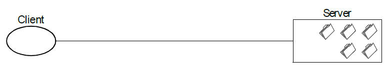


### Stateless
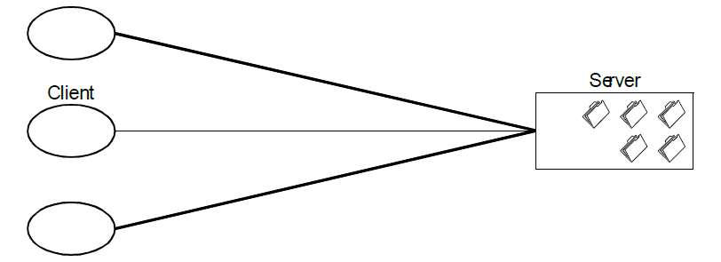


### Cache
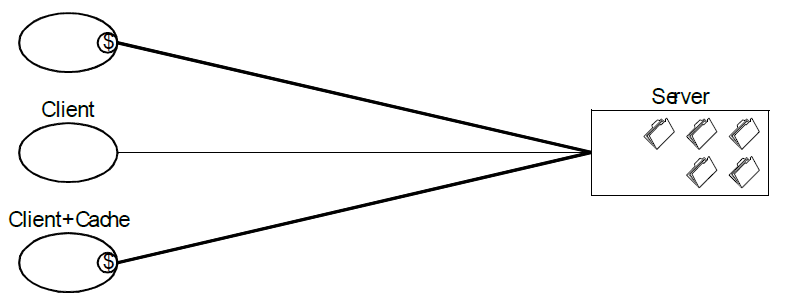


### Uniform Interface
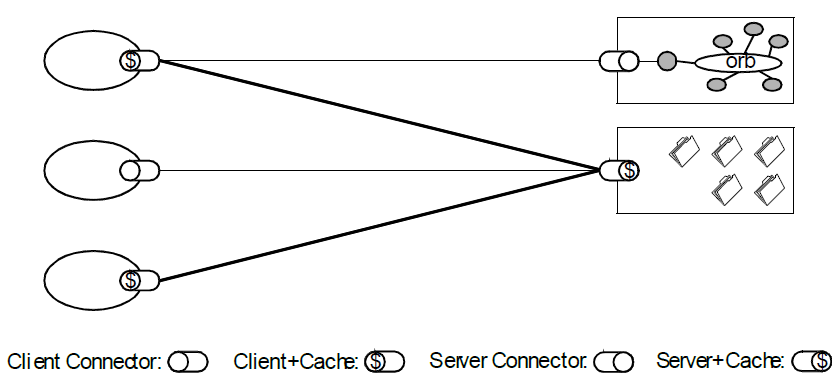


### REST 统一接口约束

- 资源的标识
- 通过表述对资源执行的操作
- 自描述的消息
- 超媒体作为应用状态引擎(HATEOAS)


### Layered System
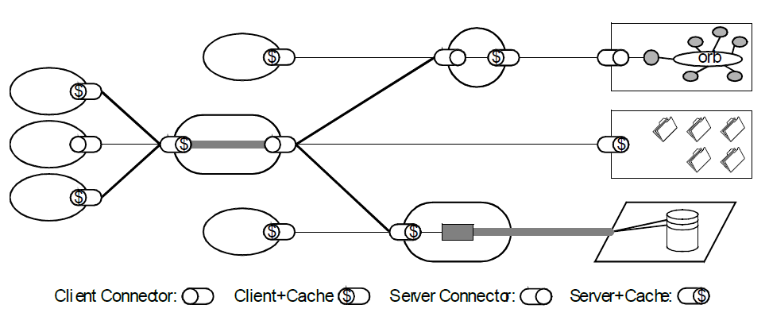


### Code-On-Demand (optional)
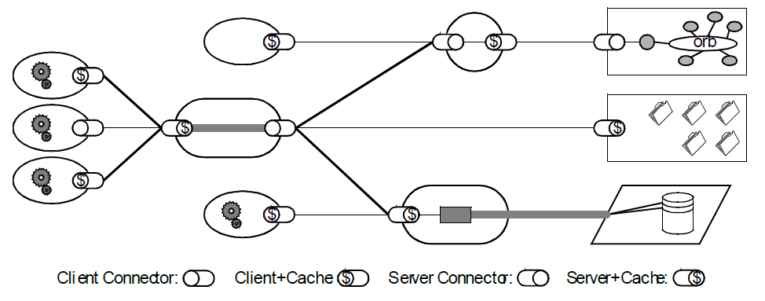


### REST架构过程视图

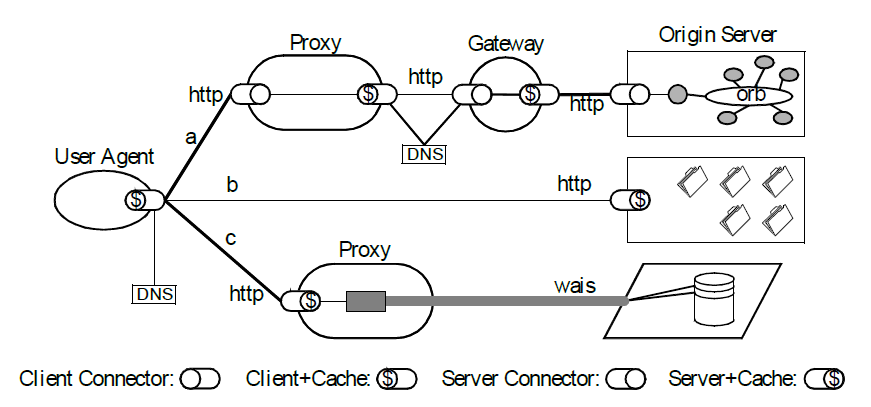


### REST 统一接口约束

- 资源的标识
- 通过表述对资源执行的操作
- 自描述的消息
- 超媒体作为应用状态引擎(Hypermedia As The Engine Of Application State, HATEOAS)


### 以HTTP为例

- 资源的标识就是资源的URI
- 资源的表述是资源在特定时刻状态的描述, 可以通过在客户-服务器之间传递资源的表述, 对资源执行某种操作
- 自描述的消息由一些标准的HTTP方法、可定制的HTTP头信息、可定制的HTTP响应代码组成
- 超媒体就是HTML, 可以使用HTML作为引擎, 驱动应用状态的迁移.


### 资源

- REST对于信息的核心抽象是资源.
- 任何能够被命名的信息都能够作为一个资源：
 - 一份文档
 - 一张图片
 - 一个与时间相关的服务(比如洛杉矶今日的天气)
 - 一个其他资源的集合
 - 一个非虚拟的对象(比如一个人)等等.
- 与面向对象设计类似, 资源是以名词为核心来组织的, 首先关注的是名词


### 表述

- 资源的表述是一段对于资源在某个特定时刻的状态的描述, 可以在客户端-服务器端之间转移(交换)
- 资源的表述可以有多种格式, 例如HTML/XML/JSON/纯文本/图片/视频/音频等等.
- 资源的表述格式可以通过协商机制来确定.请求-响应方向的表述通常使用不同的格式.


### 自描述的消息

#### 标准的HTTP方法
  - GET
  - POST
  - PUT
  - DELETE


#### 可定制的HTTP响应代码
  - 100-199表示消息中包含一个临时的信息响应
  - 200-299表示请求成功
  - 300-399表示请求需要被重定向到另一个资源
  - 400-499表示客户端发生了一个不应该重复的错误
  - 500-599表示服务器端遇到了一个错误, 但是客户端稍后可以得到一个更好的响应(或者通过某个其他服务器)


#### HTTP Headers

- 主机
- 分层的编码
- 语义独立性
- 传输独立性
- 缓存控制
- 内容协商


#### 超媒体作为应用状态的引擎

- 将Web应用看作是一个由很多状态(应用状态)组成的有限状态机
- 资源之间通过超链接相互关联, 超链接既代表资源之间的关系, 也代表可执行的状态迁移
- 以超媒体作为引擎, 驱动Web应用的状态迁移
- 通过超媒体暴露出服务器所提供的资源, 资源通过解析超媒体发现的, 而不是事先定义的


### REST架构约束

- Client-Server
- Stateless
- Cache
- Uniform Interface
  - 资源
  - 表述
  - 自描述消息
  - HATEOAS
- Layered System
- Code-On-Demand(optional)


## RESTful APIs

- 遵守REST架构约束的Web Service APIs被称作RESTful APIs


### Richardson Maturity Model


#### Level 0 - RPC

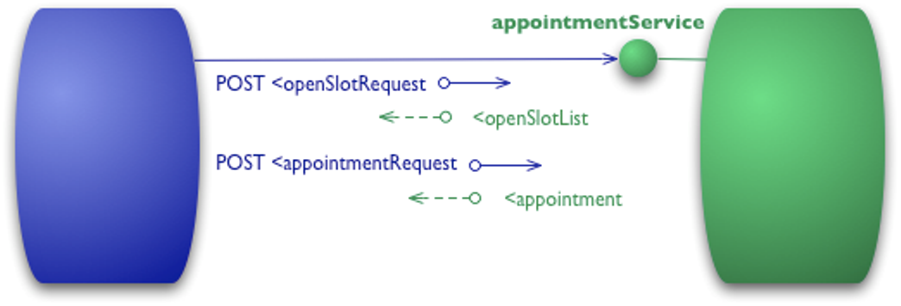


```
POST /appointmentService HTTP/1.1
[various other headers]

<openSlotRequest date = "2010-01-04" doctor = "mjones"/>
```

```
HTTP/1.1 200 OK
[various headers]

<openSlotList>
  <slot start = "1400" end = "1450">
    <doctor id = "mjones"/>
  </slot>
  <slot start = "1600" end = "1650">
    <doctor id = "mjones"/>
  </slot>
</openSlotList>
```


```
POST /appointmentService HTTP/1.1
[various other headers]

<appointmentRequest>
  <slot doctor = "mjones" start = "1400" end = "1450"/>
  <patient id = "jsmith"/>
</appointmentRequest>
```

```
HTTP/1.1 200 OK
[various headers]

<appointment>
  <slot doctor = "mjones" start = "1400" end = "1450"/>
  <patient id = "jsmith"/>
</appointment>
```

```
HTTP/1.1 200 OK
[various headers]

<appointmentRequestFailure>
  <slot doctor = "mjones" start = "1400" end = "1450"/>
  <patient id = "jsmith"/>
  <reason>Slot not available</reason>
</appointmentRequestFailure>
```


#### Level 1 - Resources

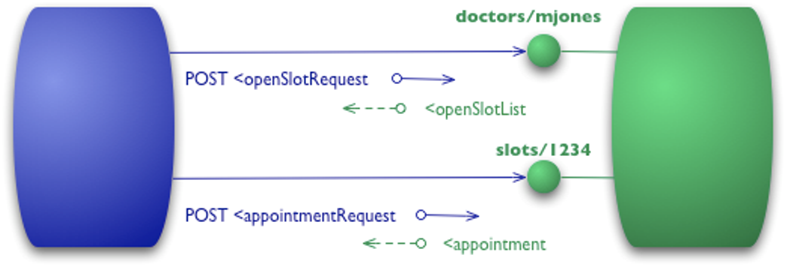


```
POST /doctors/mjones HTTP/1.1
[various other headers]

<openSlotRequest date = "2010-01-04"/>
```

```
HTTP/1.1 200 OK
[various headers]

<openSlotList>
  <slot id = "1234" doctor = "mjones" start = "1400" end = "1450"/>
  <slot id = "5678" doctor = "mjones" start = "1600" end = "1650"/>
</openSlotList>
```


```
POST /slots/1234 HTTP/1.1
[various other headers]

<appointmentRequest>
  <patient id = "jsmith"/>
</appointmentRequest>
```

```
HTTP/1.1 200 OK
[various headers]

<appointment>
  <slot id = "1234" doctor = "mjones" start = "1400" end = "1450"/>
  <patient id = "jsmith"/>
</appointment>
```


#### Level 2 - HTTP Verbs

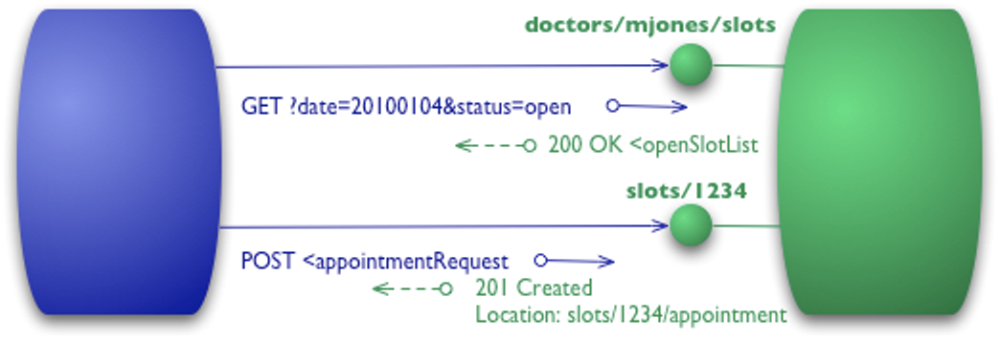


```
GET /doctors/mjones/slots?date=20100104&status=open HTTP/1.1
Host: royalhope.nhs.uk
```

```
HTTP/1.1 200 OK
[various headers]

<openSlotList>
  <slot id = "1234" doctor = "mjones" start = "1400" end = "1450"/>
  <slot id = "5678" doctor = "mjones" start = "1600" end = "1650"/>
</openSlotList>
```


```
POST /slots/1234 HTTP/1.1
[various other headers]

<appointmentRequest>
  <patient id = "jsmith"/>
</appointmentRequest>
```

```
HTTP/1.1 201 Created
Location: slots/1234/appointment
[various headers]

<appointment>
  <slot id = "1234" doctor = "mjones" start = "1400" end = "1450"/>
  <patient id = "jsmith"/>
</appointment>
```

```
HTTP/1.1 409 Conflict
[various headers]

<openSlotList>
  <slot id = "5678" doctor = "mjones" start = "1600" end = "1650"/>
</openSlotList>
```


#### Level 3 - Hypermedia Controls

<!-- .slide: data-background="white" -->

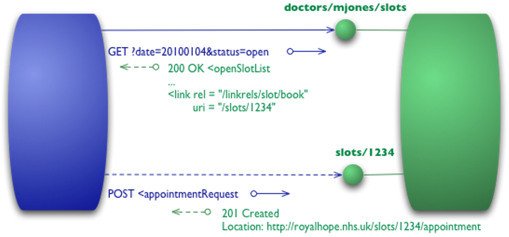


```
GET /doctors/mjones/slots?date=20100104&status=open HTTP/1.1
Host: royalhope.nhs.uk
```

```
HTTP/1.1 200 OK
[various headers]

<openSlotList>
  <slot id = "1234" doctor = "mjones" start = "1400" end = "1450">
     <link rel = "/linkrels/slot/book"
           uri = "/slots/1234"/>
  </slot>
  <slot id = "5678" doctor = "mjones" start = "1600" end = "1650">
     <link rel = "/linkrels/slot/book"
           uri = "/slots/5678"/>
  </slot>
</openSlotList>
```


```
POST /slots/1234 HTTP/1.1
[various other headers]

<appointmentRequest>
  <patient id = "jsmith"/>
</appointmentRequest>
```

```
HTTP/1.1 201 Created
Location: http://royalhope.nhs.uk/slots/1234/appointment
[various headers]

<appointment>
  <slot id = "1234" doctor = "mjones" start = "1400" end = "1450"/>
  <patient id = "jsmith"/>
  <link rel = "/linkrels/appointment/cancel"
        uri = "/slots/1234/appointment"/>
  <link rel = "/linkrels/appointment/addTest"
        uri = "/slots/1234/appointment/tests"/>
  <link rel = "self"
        uri = "/slots/1234/appointment"/>
  <link rel = "/linkrels/appointment/changeTime"
        uri = "/doctors/mjones/slots?date=20100104@status=open"/>
  <link rel = "/linkrels/appointment/updateContactInfo"
        uri = "/patients/jsmith/contactInfo"/>
  <link rel = "/linkrels/help"
        uri = "/help/appointment"/>
</appointment>
```


### REST 统一接口约束
- Level 1 - Resources
  - 资源的标识
- Level 2 - HTTP Verbs
  - 通过表述对资源执行的操作
  - 自描述的消息
- Level 3 - Hypermedia Controls
  - 超媒体作为应用状态引擎(HATEOAS)


### Example 1

Resource | Collection URI, such as http://api.example.com/v1/resources/
-------- | --------
GET      | List the URIs and perhaps other details of the collection's members.
PUT      | Replace the entire collection with another collection.
POST     | Create a new entry in the collection. The new entry's URI is assigned automatically and is usually returned by the operation.
DELETE   | Delete the entire collection.


Resource | Element URI, such as http://api.example.com/v1/resources/item17
-------- | --------
GET      | Retrieve a representation of the addressed member of the collection, expressed in an appropriate Internet media type.
PUT      | Replace the addressed member of the collection, or if it does not exist, create it.
POST     | Not generally used. Treat the addressed member as a collection in its own right and create a new entry in it.
DELETE   | Delete the addressed member of the collection.


### Example 2

A request to root / might return something like this:

#####Request

```
GET /
Accept: application/json
```
#####Response

```
200 OK
Content-Type: application/json
{
    "version": "1.0",
    "links": [
        {
            "href": "/users",
            "rel": "list",
            "method": "GET"
        },
        {
            "href": "/users",
            "rel": "create",
            "method": "POST"
        }
    ]
}
```


List users by making another request to /users:

#####Request

```
GET /users
Accept: application/json
```

#####Response

```
200 OK
Content-Type: application/json
{
    "users": [
        {
            "id": 1,
            "name": "Emil",
            "country": "Sweden",
            "links": [
                {
                    "href": "/users/1",
                    "rel": "self",
                    "method": "GET"
                },
                {
                    "href": "/users/1",
                    "rel": "edit",
                    "method": "PUT"
                },
                {
                    "href": "/users/1",
                    "rel": "delete",
                    "method": "DELETE"
                }
            ]
        },
        {
            "id": 2,
            "name": "Adam",
            "country": "Scotland",
            "links": [
                {
                    "href": "/users/2",
                    "rel": "self",
                    "method": "GET"
                },
                {
                    "href": "/users/2",
                    "rel": "edit",
                    "method": "PUT"
                },
                {
                    "href": "/users/2",
                    "rel": "delete",
                    "method": "DELETE"
                }
            ]
        }
    ],
    "links": [
        {
            "href": "/users",
            "rel": "create",
            "method": "POST"
        }
    ]
}
```


Create a new user by POSTing to /users:

#####Request

```
POST /users
Accept: application/json
Content-Type: application/json
{ "name": "Karl", "country": "Austria" }
```

#####Response

```
201 Created
Content-Type: application/json
{
    "users": {
        "id": 3,
        "name": "Karl",
        "country": "Austria",
        "links": [
            {
                "href": "/users/3",
                "rel": "self",
                "method": "GET"
            },
            {
                "href": "/users/3",
                "rel": "edit",
                "method": "PUT"
            },
            {
                "href": "/users/3",
                "rel": "delete",
                "method": "DELETE"
            }
        ]
    },
    "links": {
       "href": "/users",
       "rel": "list",
       "method": "GET"
    }
}
```


Change the existing user:

#####Request

```
PUT /users/1
Accept: application/json
Content-Type: application/json
{ "name": "Emil", "country": "Bhutan" }
```

#####Response

```
200 OK
Content-Type: application/json
{
    "users": {
        "id": 1,
        "name": "Emil",
        "country": "Bhutan",
        "links": [
            {
                "href": "/users/1",
                "rel": "self",
                "method": "GET"
            },
            {
                "href": "/users/1",
                "rel": "edit",
                "method": "PUT"
            },
            {
                "href": "/users/1",
                "rel": "delete",
                "method": "DELETE"
            }
        ]
    },
    "links": {
       "href": "/users",
       "rel": "list",
       "method": "GET"
    }
}
```


### Anti-Patterns

**`GET http://api.example.com/services?op=update_customer&id=12345&format=json`**


**`GET http://api.example.com/update_customer/12345`**


**`GET http://api.example.com/customers/12345/update`**


**`PUT http://api.example.com/customers/12345/update`**


**`PUT http://api.example.com/customers/12345`**


### Idempotence(幂等)

> From a RESTful service standpoint, for an operation (or service call) to be idempotent, clients can make that same call repeatedly while producing the same result.


- **POST** is not idempotent.
- **PUT** and **DELETE** are defined to be idempotent.
- **GET** is defined as safe, meaning they are only intended for retrieving data.


### HTTP status codes


### 2xx Success
- **200 OK** Standard response for successful HTTP requests.
- **201 Created** The request has been fulfilled, resulting in the creation of a new resource.
- **202 Accepted** The request has been accepted for processing, but the processing has not been completed.
- **204 No Content** The server successfully processed the request and is not returning any content.


### 3xx Redirection
- **301 Moved Permanently** This and all future requests should be directed to the given URI.
- **302 Found** This and all future requests should be directed to the given URI temporarily.
- **304 Not Modified** Indicates that the resource has not been modified.
- **307 Temporary Redirect** like 301, but do not allow the HTTP method to change.
- **308 Permanent Redirect** like 302, but do not allow the HTTP method to change.


### 4xx Client errors
- **400 Bad Request** The server cannot or will not process the request due to an apparent client error.
- **401 Unauthorized** Unauthenticated, i.e. the user does not have the necessary credentials.
- **403 Forbidden** The request was valid, but the server is refusing action.
- **404 Not Found** The requested resource could not be found but may be available in the future.


- **405 Method Not Allowed** A request method is not supported for the requested resource.
- **406 Not Acceptable** A request method is not supported for the requested resource.
- **407 Proxy Authentication Required** The client must first authenticate itself with the proxy.
- **409 Conflict** Indicates that the request could not be processed because of conflict in the request.


### 5xx Client errors
- **500 Internal Server Error** A generic error message.
- **501 Not Implemented** The server either does not recognize the request method.
- **502 Bad Gateway** The server was acting as a gateway or proxy and received an invalid response from the upstream server.
- **503 Service Unavailable** The server is currently unavailable (because it is overloaded or down for maintenance).
- **504 Gateway Timeout** The server was acting as a gateway or proxy and did not receive a timely response from the upstream server.


# 参考资料

- [Representational state transfer](https://en.wikipedia.org/wiki/Representational_state_transfer)
- [Architectural Styles and the Design of Network-based Software Architectures](http://www.ics.uci.edu/~fielding/pubs/dissertation/top.htm)
- [介绍Web基础架构设计原则的经典论文《架构风格与基于网络的软件架构设计》导读](http://www.infoq.com/cn/articles/doctor-fielding-article-review)
- [Richardson Maturity Model](http://martinfowler.com/articles/richardsonMaturityModel.html)
- [List of HTTP status codes](https://en.wikipedia.org/wiki/List_of_HTTP_status_codes)
- [What exactly is RESTful programming?](http://stackoverflow.com/questions/671118/what-exactly-is-restful-programming)
- [REST API Tutorial](http://www.restapitutorial.com/)
