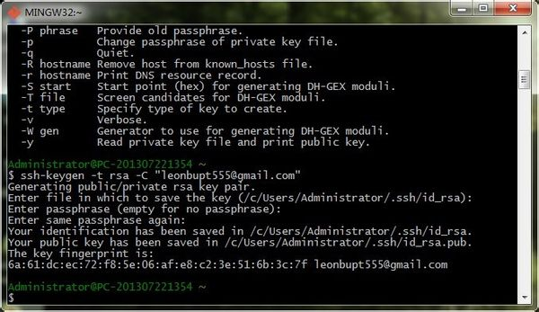

# Java Unit Testing


## Git
- http://git-scm.com/
- Git is a free and opensource distributed version control system
- The results of the 2014 Eclipse Community Survey show Git (33.3%) surpassing Subversion (30.7%) as expected from the trend in the previous year


### GitHub


### GitLab(Code Club)


### Fork A Git Repositiory


### Clone The Repositiory




$ git clone https://github.com/coney/linux.git


### Make Changes, Commit And Push
```
$ echo "Hello Linux" >> README
$ git status

$ git add .
$ git status

$ git commit -m "update README"
$ git status

$ git push
$ git status
```


### Send Pull(Merge) Request


## JUnit

- http://junit.org/
- JUnit is a simple framework to write repeatable tests
- A research survey performed in 2013 across 10,000 GitHub projects found that JUnit, along with slf4j-api, are the most popular libraries. Each library was used by 30.7% of projects


### Create a test

``` java
import org.junit.Test;

import static org.junit.Assert.assertTrue;

public class MyTest {
    @Test
    public void testNewArray() throws Exception {
        final boolean result = false;
        assertTrue(result);
    }
}
```


### Assertions

```
java.lang.AssertionError
	at org.junit.Assert.fail(Assert.java:86)
	at org.junit.Assert.assertTrue(Assert.java:41)
	at org.junit.Assert.assertTrue(Assert.java:52)
	at macdao.MyTest.testNewArray(MyTest.java:11)
```


### assertThat

```java
assertThat([value], [matcher statement]);
```

Note: Joe Walnes built a new assertion mechanism on top of what was then JMock 1


```java
import org.junit.Test;

import static org.hamcrest.CoreMatchers.is;
import static org.junit.Assert.assertThat;

public class MyTest {
    @Test
    public void testNewArray() throws Exception {
        final boolean result = false;
        assertThat(result, is(true));
    }
}

```
```
Expected: is <true>
     but: was <false>
```


### matchers

org.hamcrest.CoreMatchers

```java
assertThat("good", is("good"));

assertThat(new Object(), notNullValue());

assertThat(new Object(), not(sameInstance(new Object())));

assertThat("good", startsWith("goo"));

assertThat(Arrays.asList(1, 2), hasItem(1));
```


```java
assertThat("fab", both(containsString("a")).and(containsString("b")));

assertThat("good", not(allOf(equalTo("bad"), equalTo("good"))));

assertThat("good", anyOf(equalTo("bad"), equalTo("good")));

assertThat(7, not(either(equalTo(3)).or(equalTo(4))));
```


### Ignoring a Test

```java
@Ignore("Test is ignored as a demonstration")
@Test
public void testSame() {
    assertThat(1, is(1));
}
```


### fixture annotations

```java
import org.junit.*;
import static java.lang.System.out;
public class MyTest {
    @BeforeClass
    public static void setUpClass() { out.println("@BeforeClass"); }
    @AfterClass
    public static void tearDownClass() { out.println("@AfterClass"); }
    @Before
    public void setUp() throws Exception { out.println("@Before"); }
    @After
    public void tearDown() throws Exception { out.println("@After"); }
    @Test
    public void test1() throws Exception { out.println("test1"); }
    @Test
    public void test2() throws Exception { out.println("test2"); }
}
```
```
@BeforeClass
@Before
test1
@After
@Before
test2
@After
@AfterClass
```


### Expected Exceptions

```java
@Test(expected = IndexOutOfBoundsException.class)
public void empty() {
     new ArrayList<Object>().get(0);
}
```


```java
@Test
public void testExceptionMessage() {
    try {
        new ArrayList<Object>().get(0);
        fail("Expected an IndexOutOfBoundsException to be thrown");
    } catch (IndexOutOfBoundsException exception) {
        assertThat(exception.getMessage(), is("Index: 0, Size: 0"));
    }
}
```


## Exercise 1

你是一名体育老师，在某次课距离下课还有五分钟时，你决定搞一个游戏。

此时有100名学生在上课。游戏的规则是：

1. 你首先说出三个不同的特殊数，要求必须是个位数，比如3、5、7。
2. 让所有学生拍成一队，然后按顺序报数。
3. 学生报数时, 如果所报数字是特殊数（3, 5, 7）的倍数，那么不能说该数字，而要说Fizz；


编写Student的测试

- 当三个特殊数是3、5、7时，学生1说1
- 当三个特殊数是3、5、7时，学生3说Fizz
- 当三个特殊数是3、5、7时，学生5说Fizz
- 当三个特殊数是3、5、7时，学生7说Fizz


`$ mvn test`


### IntelliJ IDEA 快捷键

Key                  | Description
-------------------- | -----------
`Alt + Enter`        | Quick fixes
`Ctrl + Shift + T`   | Create new test/go to test
`Alt + Insert`       | Generate test
`Ctrl + Alt + V`     | Extract variable
`Ctrl + Alt + F`     | Extract field
`Ctrl + Shift + F10` | Run test
`Shift + F10` | Run last test

http://www.jetbrains.com/idea/docs/IntelliJIDEA_ReferenceCard.pdf


## Exercise 2

游戏进行一轮之后, 你决定增加一些游戏难度.

学生们将按照如下规则重新进行报数:

- 如果所报数字是第一个特殊数(3)的倍数，那么不能说该数字，而要说Fizz；
- 如果所报数字是第二个特殊数(5)的倍数，那么要说Buzz；
- 如果所报数字是第三个特殊数(7)的倍数，那么要说Whizz。


编写Student的测试
- 当三个特殊数是3、5、7时，学生**5**说Buzz
- 运行测试

<br/>

完善Student的实现
- 当学生所报数是**5**的倍数时, 学生改报Buzz
- 运行测试


编写Student的测试
- 当三个特殊数是3、5、7时，学生**7**说Whizz
- 运行测试

<br/>

完善Student的实现
- 当学生所报数是**7**的倍数时, 学生改报Whizz
- 运行测试


### Test-driven development


## Exercise 3

编写FizzGameTest的测试

- 输出应该是100行
- 当输入是3、5、7时，学生1说1
- 当输入是3、5、7时，学生3说Fizz
- 当输入是3、5、7时，学生5说Buzz


编写Student的测试

- 当三个特殊数是3、5、7时，学生1说1
- 当三个特殊数是3、5、7时，学生3说Fizz
- 当三个特殊数是4、5、6时，学生1说1
- 当三个特殊数是4、5、6时，学生3说3
- 当三个特殊数是4、5、6时，学生4说Fizz


## .gitignore

```
# idea project directory
.idea/
target
# will match my.o and my.a
*.[oa]
# will match hello and hellp but not hellop
hell?
```


## 课后练习

- 需求
  - 学生报数时，如果所报数字同时是两个特殊数的倍数情况下，也要特殊处理.
  - 第一个特殊数和第二个特殊数的倍数，那么不能说该数字，而是要说FizzBuzz，以此类推。
  - 如果同时是三个特殊数的倍数，那么要说FizzBuzzWhizz。
- 有FizzGame和Student的测试和实现
- 提交到Code Club上并发Merge Request
