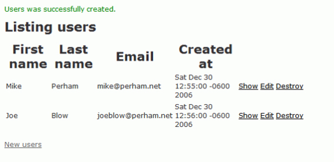
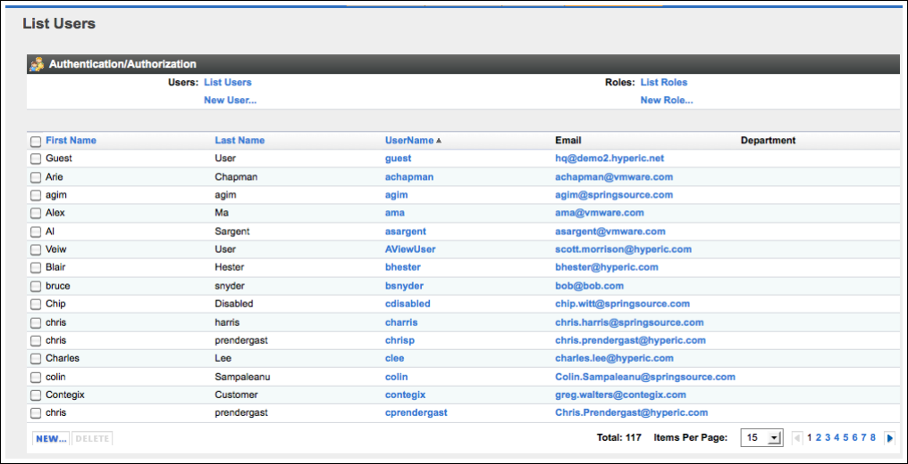
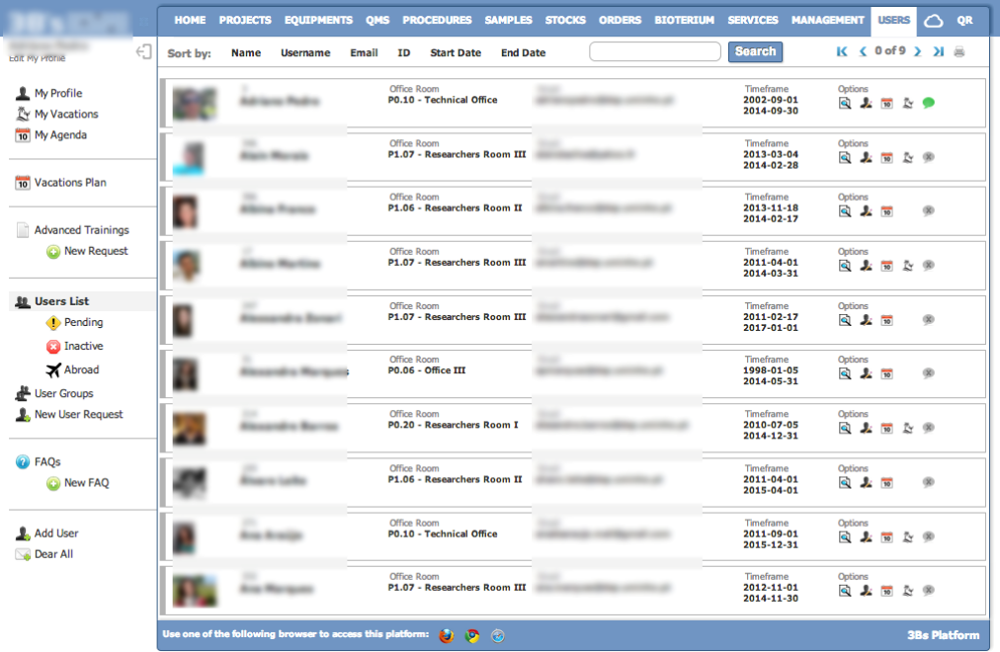
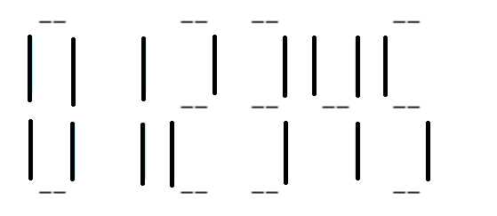
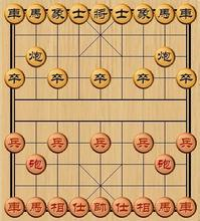

# Tasking


### 为什么要任务分解
> 凡事预则立 不预则废
>      ——《礼记·中庸》


### 任务拆分的评价标准
> INVEST in good stories, and SMART tasks  
> - Bill Wake


### INVEST
- Independent
- Negotiable
- Valuable
- Estimable
- Small
- Testable

Note:
- Independent: 最理想情况是Task之间没有顺序依赖, 至少两个Task互相没有循环依赖(SOLID的I)
- Negotiable: 可协商, 不要直奔细节, 在实现时进行考虑
- Valuable: 对Story或Stackholder有价值
- Estimable: 可估算, 不可估算点1未理解完成, 2太大
- Small: 足够小, 辅助Estimable, 根据情况来
- Testable: 可测试, 例如有输入输出, 验证方法
https://xp123.com/articles/invest-in-good-stories-and-smart-tasks/


### SMART
- Specific
- Measurable
- Achievable
- Relevant
- Time-Boxed

Note:
- Specific: 同Testable, 可开发, 可验证
- Measurable: Estimable, 同时有完成标志, 例如AC, 什么情况下可以算完成
- Achievable: 可实现
- Relevant: Task应该与Story相关
- Time-Boxed: 有预计时间


### 任务拆分指导思想
- 用最快的速度实现一个Walking Skeleton
- 给Walking Skeleton增加功能


### Walking Skeleton









### 项目经理的思维方式
- 用户最关注的功能是什么？
- 哪些功能是用户happy to have的？
- 为了交付核心功能，还有哪些事情是必须要做的？
- 核心工作流是否还可以简化？


### 开发人员的思维方式
- MySQL or Mongo
- 是否要引入缓存？
- 同步or异步？
- 消息响应or轮询?


### 做Tasking时，你其实是自己的项目经理


### LCD显示程序

写一个显示LCD数字的程序，要求可以调整数字大小




### 根据开发过程分解(误区一)
- 设计
- 编码
- 做单元测试
- 做集成联调
- 写维护文档


### 根据架构分解(误区二)
- 实现Model层,用长度为7的数组保存一个数字
- 实现View层, 通过横竖线显示数字, 支持放大
- 实现Controller层, 通过命令控制创建Model并展现


### Cake


### 根据处理流程分解(误区三)
- 解析用户在命令行输入的“lcd –s 2  1234567”
- 生成每个数字的LCD格式
- 根据尺寸调整生成的LCD显示大小
- 将所有数字的LCD显示内容收集到一起，并调整间距
- 显示


### 建议的分解方式之一
- 能打印一个数字，大小为1，输入为硬编码
- 能打印多个数字
- 增加控制字符大小功能
- 用户可以指定输入的字符


### 怎样得到walking skeleton
1. 列出一个端到端场景完整步骤
2. 对每一步提出以下问题：
       **如果想消除这一步，需要做哪些假设？**
   如果假设合理，就用一些“简陋”的方式暂时替代
3. 重复以上两步


### LCD程序的walking skeleton
- 用户在命令行输入 “lcd –s 2  1234567”
- **生成每个数字的LCD格式**
- 根据尺寸调整生成的LCD符号大小
- 将所有数字的LCD格式收集到一起，并调整间距
- **显示**


### 练习

实现一个人与人对弈的象棋软件




```
1. 在命令行输入步法，然后打印出每个棋子位置
mov black pao (2, 3) (5, 3)
mov red pao (2, 8) (5, 8)
... ...
```


```
2. 对走棋的顺序进行判断
mov black pao (2, 3) (5, 3)
mov black bing (5, 4) (5, 5) -------error
```


```
3.步法是否符合象棋规则
1) 符合棋子属性
2）是否被其他棋子挡住（憋马脚）
```


```
4.走完一步对局面进行更新
1) 如果有吃子，被吃的是否为将（帅），如果有游戏结束
```


```
5. 实现界面
```


### 任务分解模式


#### Workflow Steps
As a content manager, I can publish a news story to the corporate

- I can publish a news story directly to the corporate website.
- I can publish a news story with editor review.
- I can publish a news story with legal review.
- I can view a news story on a staging site.
- I can publish a news story from the staging site to production.


#### Simple/Complex
As a user, I can search for flights between two destinations.

- specifying a max number of stops.
- including nearby airports.
- using flexible dates.
- etc.


#### Business Rule Variations
As a user, I can search for flights with flexible dates.

- as “n days between x and y.”
- as “a weekend in December.”
- as “± n days of x.”


#### Major Effort
As a user, I can pay for my flight with VISA, MasterCard, Diners Club, or American Express.

- I can pay with one credit card type (of VISA, MC, DC, AMEX).
- I can pay with all four credit card types (VISA, MC, DC, AMEX) (given one card type already implemented).


#### Variations in Data
As a user, I can search for transportation providers by trip origin and destination.

- As a user, I can search for transportation providers by trip origin and destination as counties.
- As a user, I can search for transportation providers by trip origin and destination as counties, cities, towns, or neighborhoods.
- Providers can serve different geographic areas for trip origin and destination.


#### Data Entry Methods
As a user, I can search for flights between two destinations.

- using simple date input.
- with a fancy calendar UI.


#### Defer Performance
As a user, I can search for flights between two destinations.

- slow—just get it done, show a “searching” animation.
- in under 5 seconds.


#### Operations (e.g. CRUD)
As a user, I can manage my account.

- I can sign up for an account.
- I can view my account details.
- I can edit my account settings.
- I can revoke my account.


#### Break Out a Spike
As a user, I can pay by credit card.

- Investigate credit card processing.
- Implement credit card processing.


#### 如何选择模式

- 能够帮你抽取出高价值任务, 剥离低价值任务
- 能够让你较为平均的分配粒度更细的任务


#### 练习
对Guess Number进行任务分解
