## Modern Testing Overview


## Unit Testing

> **Unit testing** is a software development process in which the smallest testable parts of an application, called units, are individually and independently scrutinized for proper operation.


- Testing Framework
  - JUnit, Google Test, Jasmine  

- Mocking Framework
  - Mockito, PowerMock, Google Mock, Sinon  

- Coverage
  - Jacoco, GCov, ‎Cobertura, Istanbul  


#### Testing Framework(JUnit)

``` java
import static org.junit.Assert.assertEquals;
import org.junit.Test;

public class CalculatorTest {
  @Test
  public void evaluatesExpression() {
    Calculator calculator = new Calculator();
    int sum = calculator.evaluate("1+2+3");
    assertEquals(6, sum);
  }
}
```


#### Mocking Framework(PowerMock)

``` java
@Test
public void demoStaticMethodMocking() throws Exception {
    mockStatic(IdGenerator.class);

    // setup mock expectation
    when(IdGenerator.generateNewId()).thenReturn(2L);

    new ClassUnderTest().methodToTest();

    // Optionally verify that the static method was actually called
    verifyStatic();
    IdGenerator.generateNewId();
}
```


#### Coverage Report

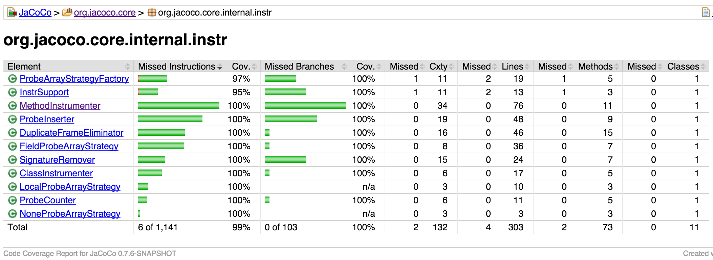


### Javascript Unit Testing
#### Testing Framework(Jasmine)
``` javascript
describe("A spec", function() {
  it("is just a function, so it can contain any code", function() {
    var foo = 0;
    foo += 1;

    expect(foo).toEqual(1);
  });

  it("can have more than one expectation", function() {
    var foo = 0;
    foo += 1;

    expect(foo).toEqual(1);
    expect(true).toEqual(true);
  });
});
```


#### Mocking Framework(Jasmine)

```javascript
it("tracks that the spy was called", function() {
  var foo, bar, fetchedBar;
  foo = {
    setBar: function(value) { bar = value; },
    getBar: function() { return bar; }
  };
  spyOn(foo, "getBar").and.returnValue(745);
  foo.setBar(123);
  fetchedBar = foo.getBar();

  expect(foo.getBar).toHaveBeenCalled();
  expect(bar).toEqual(123);
  expect(fetchedBar).toEqual(745);
});
```


### Coverage Report(Istanbul)

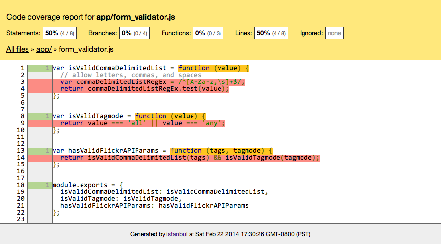


> Node.js® is a platform built on Chrome's JavaScript runtime for easily building fast, scalable network applications.


> Karma is a JavaScript command line tool that can be used to spawn a web server which loads your application's source code and executes your tests.


### How Karma Works
- Spawns a web server to serve the javscript sources
- Starts a web browser that executes source code against test code
- Examines the results for each test against each browser
- Displays the results to the developer such that they can see which browsers and tests passed or failed


### Javascript Testing Example


### Test-Driven Development(TDD)


### Advantages

- Forces radical simplification of the code
- Forces you to write small classes focused on one thing
- Helps create loosely coupled code
- Refactoring Encourages Improvements


### Disadvantages?
- TDD is hard to learn, especially on your own.
- You can expect reduced productivity for 2-4 months after starting.
- The test cases you wrote may not be the right thing  that the users need


### Behavior-driven development(BDD)
> Behavior-driven development (or BDD) is an agile software development technique that encourages collaboration between developers, QA and non-technical or business participants in a software project.


### Gherkin Language

> Gherkin is a Business Readable, **Domain Specific Language** created especially for behavior descriptions. It gives you the ability to remove logic details from behavior tests. Gherkin serves two purposes: serving as your project's documentation and automated tests.


``` javascript
describe("A spec", function() {
  it("is just a function, so it can contain any code", function() {
    var foo = 0;
    foo += 1;

    expect(foo).toEqual(1);
  });

  it("can have more than one expectation", function() {
    var foo = 0;
    foo += 1;

    expect(foo).toEqual(1);
    expect(true).toEqual(true);
  });
});
```


``` java
@Test
public void test_student1_should_say_1() throws Exception {
    assertThat(result[0], is("1"));
}

@Test
public void test_student3_should_say_Fizz() throws Exception {
    assertThat(result[3 - 1], is("Fizz"));
}

@Test
public void test_student5_should_say_Buzz() throws Exception {
    assertThat(result[5 - 1], is("Buzz"));
}
```


> Cucumber lets software development teams describe how software should behave in plain text. The text is written in a business-readable domain-specific language and serves as documentation, automated tests and development-aid - all rolled into one format.


### 1. Describe behaviour in plain tex
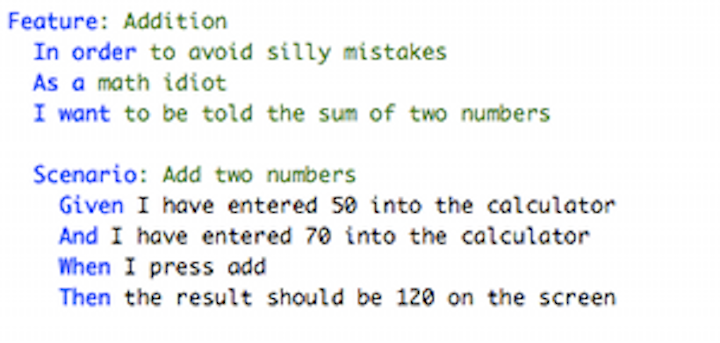


### 2. Write a step definition in Ruby
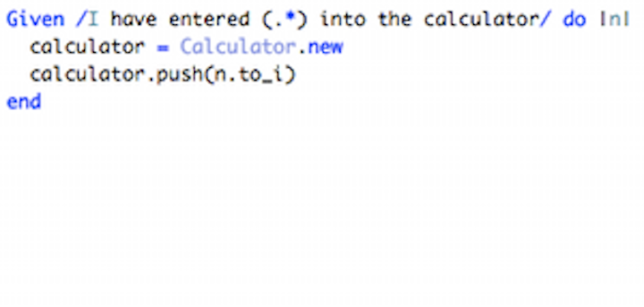


### 3. Run and watch it fail
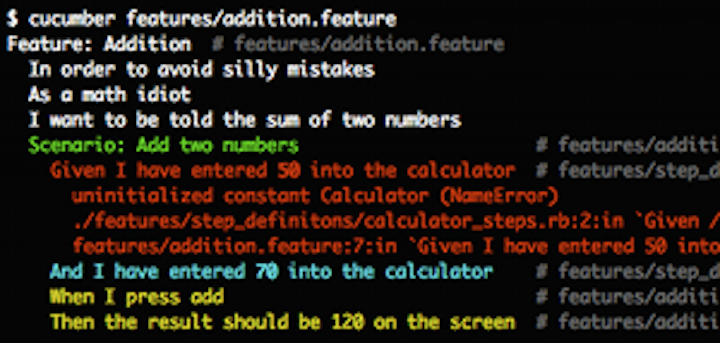


### 4. Write code to make the step pass
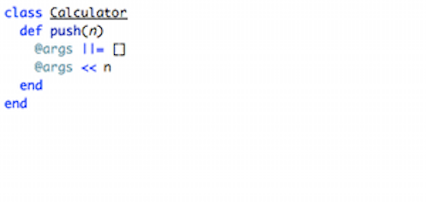


### 5. Run again and see the step pass
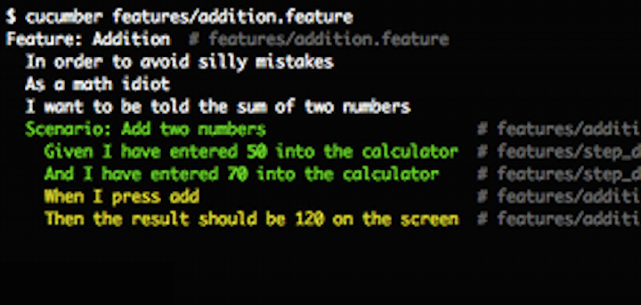


### 6. Repeat 2-5 until green like a cuke
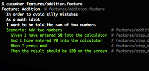


### UI Automation Testing Example

- Cucumber Ruby
- Selenium-Webdriver
- RSpec


### From TDD TO BDD


### Integration Contract Test


### Consumer Driven Contract


### Self Initializing Fake

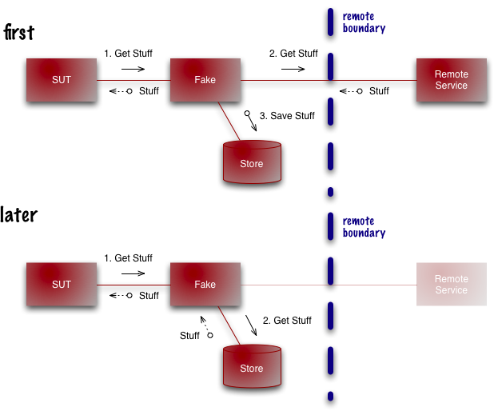


Create contracts based on the documented structure

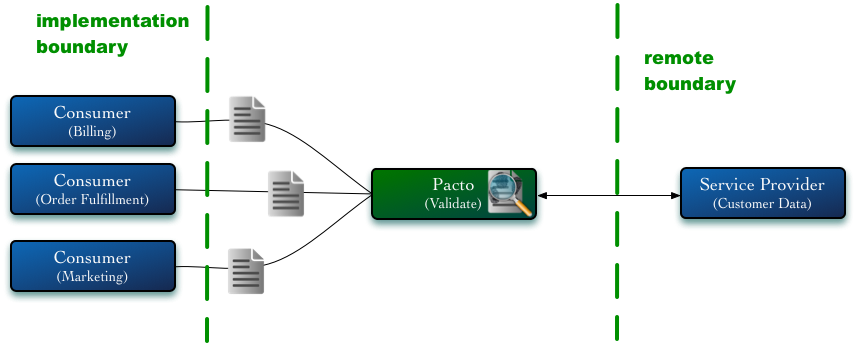


Create stubbed responses to test consumers

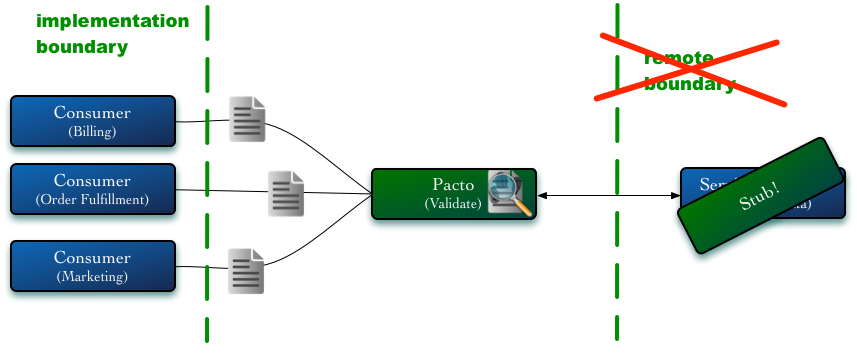


Create sample requests for simulated consumers to test providers

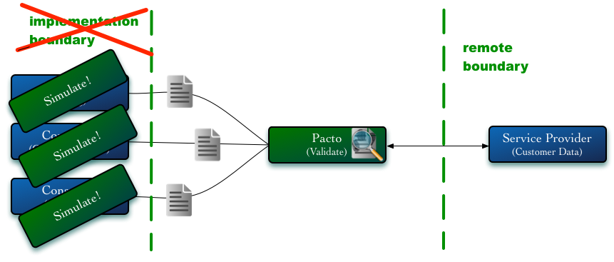


### Continuous Integration(CI)


#### Visualisation(Dashboard)


