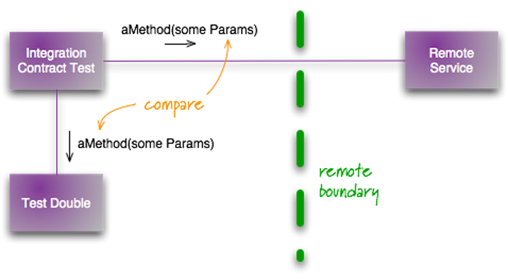
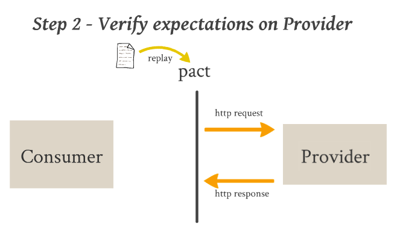

## Modern Testing Overview

## Unit Testing

> **Unit testing** is a software development process in which the smallest testable parts of an application, called units, are individually and independently scrutinized for proper operation.

- Testing Framework
  - JUnit, Google Test, Jasmine  

- Mocking Framework
  - Mockito, PowerMock, Google Mock, Sinon  

- Coverage
  - Jacoco, GCov, ‎Cobertura, Istanbul  

### C/C++ Unit Testing

### Java Unit Testing

### Javascript Unit Testing

### TDD

### BDD

### Cucumber

### UI Automation Testing

### Selenium

### Pact
#### Integration Contract Test

### Consumer Driven Contract
#### Generate Contract

#### Verify Contract

### Example

### Continuous Integration(CI)

#### Visualisation(Dashboard)
